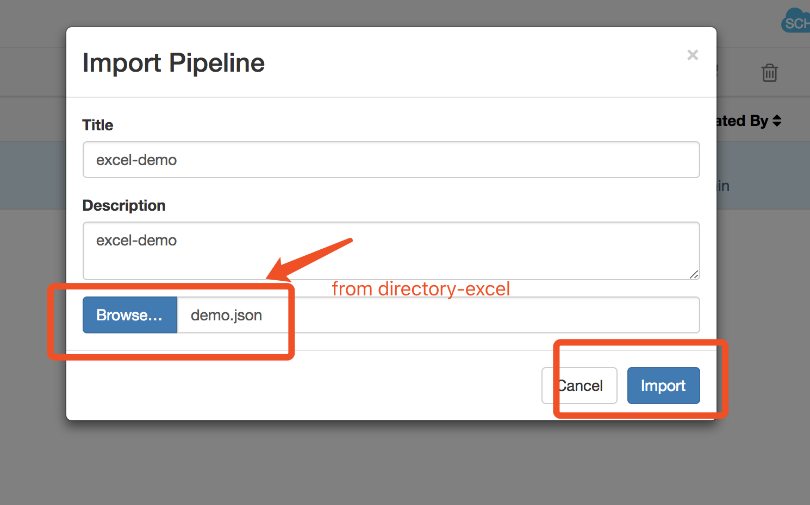
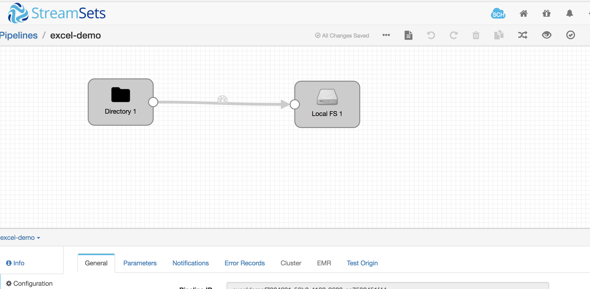
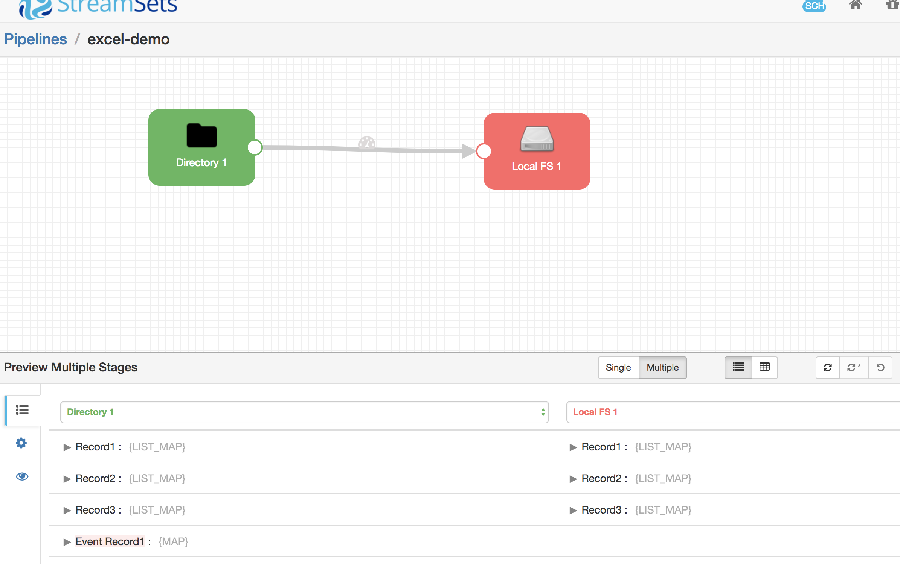

# How to Run

```code
cd micro-service
docker-compose up -d
```

## config

* copy data

```code
project root directory

docker cp data/ micro-service_sets_1:/data/excel
```

* load steamsets configfiles



* run






